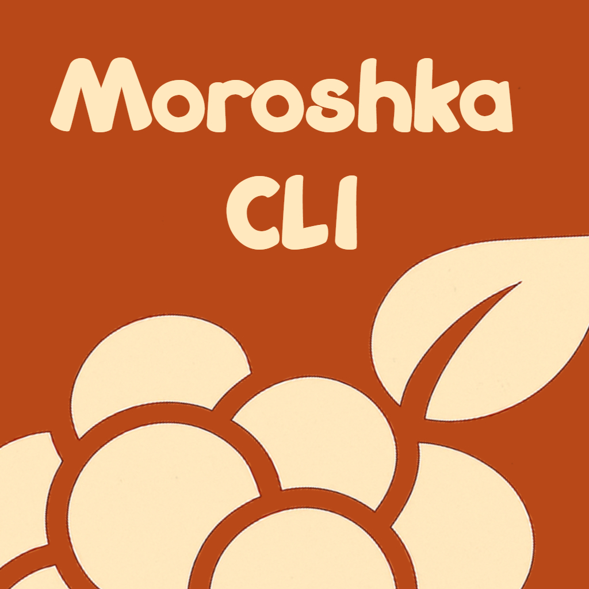

#  Moroshka CLI

CLI tool for working with Moroshka Unity modules.

## Quick installation (Windows)

```powershell
# Run the build and install script
.\build-tool.bat
```

## Usage

```bash
# Initialize project
moroshka init

# List modules
moroshka ls

# Clone all modules
moroshka clone all

# Clone modules by indexes
moroshka clone indexes

# Create new UPM module
moroshka new upm

# Create new UPM project
moroshka new upm-project
```
