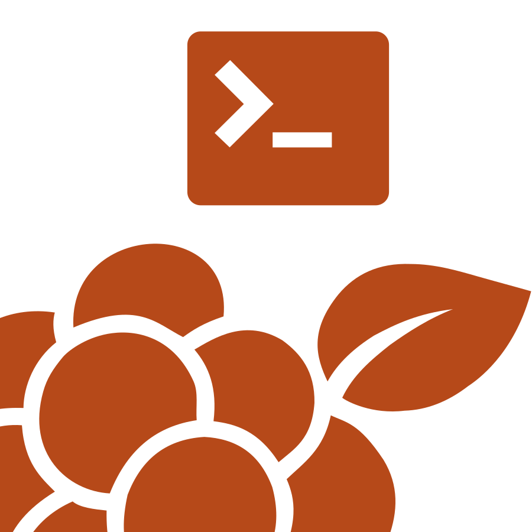

# 


[](https://github.com/moroshka-game/moroshka-cli/blob/main/LICENSE.md)

[](https://semver.org/)
[](https://www.conventionalcommits.org/en/v1.0.0/)
[](https://keepachangelog.com/en/1.1.0/)

## Quick installation (Windows)

```powershell
# Run the build and install script
.\build-tool.bat
```

## Usage

```bash
# Initialize project
moroshka init

# List modules
moroshka ls

# Clone all modules
moroshka clone all

# Clone modules by indexes
moroshka clone indexes

# Create new UPM module
moroshka new upm

# Create new UPM project
moroshka new upm-project
```
